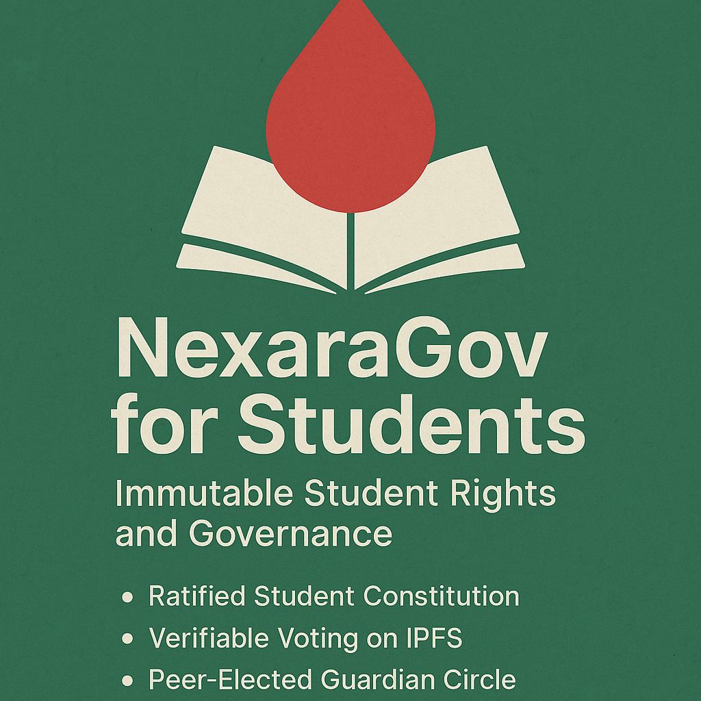

# 🎓 NexaraGov for Students of Bangladesh

> “We dedicate this to the students who were silenced.  
> And to those who still dare to speak.”

---

## 🛡️ Why NexaraGov for Students?

- Because no student should fear injustice.
- Because no constitution should be rewritten in darkness.
- Because no voice should be erased.

---

## 📚 What You’ll Find Here

| Section | Description |
|---------|-------------|
| [NexaraGov: Student Edition](nexaragov-student-edition.md) | A governance framework built for student unions |
| [Student Constitution](constitution-student.md) | Immutable, ratifiable, IPFS-anchored charter |
| [Onboarding Guide](onboarding-guide.md) | How to join, vote, and protect your rights |
| [IPFS Manifest](ipfs-manifest.md) | Verifiable record of every ratified document |
| [Student Guardian Circle](guardian-circle-student.md) | Peer-elected ethical protectors of the system |

---

## 🕊️ In Memory of July 2024

> “They tried to silence the students.  
> But they only amplified the truth.”

This system is dedicated to those who were lost.  
And to those who will never be lost again.

---

## 🌐 Powered by Nexara

- DID-based identity (NexID Vault)  
- Verifiable voting (NexVote)  
- Immutable documentation (NexDocs)  
- Guardian oversight (Guardian Circle)  
- IPFS/IPNS-based permanence

---

## 🧭 Start Here

👉 [Read the Constitution](constitution-student.md)  
👉 [Join the Guardian Circle](guardian-circle-student.md)  
👉 [Verify a Document](ipfs-manifest.md)
